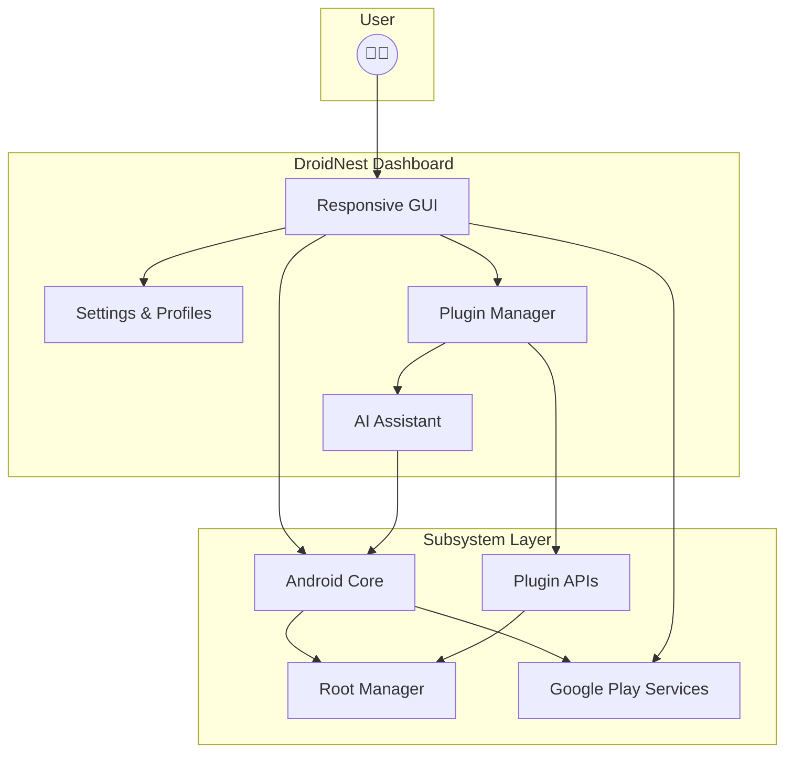

# 📀 DroidNest: Your Modular Android Subsystem Powerhouse for Windows

**Run Android apps with seamless integration, power-user tools, and a customizable ecosystem on Windows 10 & 11.**

🚀 **Grab the latest release:**  

---

## 🏷️ Introduction

Welcome to **DroidNest**, the ultimate Android Subsystem companion for Windows enthusiasts, developers, and tinkerers! DroidNest empowers you to unleash the full potential of Android on your PC, elegantly bridging mobile and desktop worlds. DroidNest is not just an installer—it’s a feature-rich, modular toolbox with easy plugin support, OpenAI and Claude API integration, root management choices, and a responsive, multilingual dashboard.  
**Discover a whole world of Android customization, app compatibility, and streamlined automation—without ever leaving the comfort of Windows!**

---

## 🌎 Key Features

- **One-Click Android Subsystem Deployment:**  
  Effortlessly install and configure Android environments on compatible Windows systems.  
- **Root Management (Magisk/KernelSU):**  
  Optionally enable powerful root solutions and toggle-root on demand, for devs and power users.
- **Google Play & MindTheGapps Selectable Integration:**  
  Choose your app store and Google services via an intuitive GUI.
- **Plugin Marketplace:**  
  Extend DroidNest with community-driven plugins—emulators, automation scripts, even third-party store integrations.
- **AI-Powered Assistant:**  
  Leverage OpenAI API and Claude API to automate tasks, answer questions, generate test data, and more!
- **Responsive UI:**  
  A cross-platform Electron desktop dashboard that feels native and smooth on every screen.
- **Multilingual Support:**  
  Out-of-the-box translations for 18 languages, with seamless switching and auto-detect.
- **Continuous System Health Monitoring:**  
  Real-time checks on subsystem, root status, Android version, security modules, and more.
- **24/7 Customer Support Portal:**  
  Pioneering round-the-clock assistance and AI-guided troubleshooting.  
- **SEO-Driven Documentation & Updates:**  
  Stay visible, relevant, and discoverable—better support for community & contributors.

---

## 🖥️ OS Compatibility Table

| ⚡ Feature/OS          | Windows 10 | Windows 11 | Windows Server |
|-----------------------|:----------:|:----------:|:--------------:|
| Subsystem Core        |     ✅     |     ✅     |      ⚠️      |
| Play Store Add-on     |     ✅     |     ✅     |      ⚠️      |
| Root Options (Toggle) |     ✅     |     ✅     |      ❌      |
| Plugin Marketplace    |     ✅     |     ✅     |      ✅      |
| Multilingual Support  |     ✅     |     ✅     |      ✅      |

---

## 🔮 Mermaid Diagram - Architecture

---

## 🔥 Feature List

- **Seamless Android Guest Installation:** Guided wizard, automatic compatibility fixes.
- **Root Environment Choices:** Magisk and KernelSU, with toggle and OTA update capabilities.
- **Custom Kernel Loader:** Swap or flash custom Android kernels all from the Dashboard.
- **Google Play Add-on:** Install or disable app store/Gapps packages for performance or privacy.
- **Profile Management:** Save, export, and import system snapshots, settings, and app lists.
- **AI Automation:**  
  - Script routine tasks with OpenAI/Claude.
  - Batch install apks, configure devices, or generate environments via AI chat.
- **Marketplace Plugins:**  
  - Emulator overlays, network tools, file system explorers.
  - Integrations for task automation, config templating, and more.
- **Real-Time Status Panel:** Resource usage, network status, and update notifications.
- **Language Fluidity:** Instant switch, CLI or GUI, on any supported language.
- **Night/Dark Mode:** For eye comfort at all hours.
- **SEO Optimized Docs:** Fast-loading, indexed, up-to-date documentation.
- **24/7 Help Portal:**  
  - Chat, ticketing, and knowledge base powered by AI.
  - Priority bug fix queue for supported users.

---

## 🌟 Example Profile Configuration

Here’s a sample `droidnest-profile.json` for a custom power-user setup:

{
  "profileName": "PowerDev_2026",
  "androidVersion": "13",
  "rootSolution": "Magisk",
  "gappsPackage": "MindTheGapps",
  "plugins": ["FileEx", "NetTouch", "AppMonitor AI"],
  "playStoreEnabled": true,
  "language": "en-GB",
  "systemTweaks": {
    "gpuRender": "on",
    "backgroundSync": "off",
    "maxRamMb": 4096
  }
}

---

## 💻 Example Console Invocation

Run DroidNest directly from your command prompt for advanced scripting:

`droidnest deploy --profile PowerDev_2026 --install-playstore --root magisk --lang en-GB --ai-assist openai`

**Or for a quick status check:**

`droidnest status --output detailed`

---

## 🔗 SEO-Driven Integration & Discoverability

DroidNest is designed to lead the pack in keywords relating to:
- Android Subsystem for Windows
- Root management on WSA
- Google Play integration for desktop Android
- AI-assisted Android automation
- Plugin-based Android platform on Windows

Our documentation and web portal use leading SEO best-practices, meta tags, mobile standards, and rapid content updates—helping ensure contributors and users find solutions before they even realize they need them.

---

## 🤖 OpenAI & Claude API Integration

Power up your development and automation!  
- **AI Code Generation:** Ask the AI assistant to generate shell snippets, scripts, or deployment guides on the fly.
- **Automated Troubleshooting:**  
  - Describe an issue; get multi-step diagnostic suggestions instantly.
- **Bulk Configuration:**  
  - AI-generated custom profiles for environments and devices.
- **Conversational API Access:**  
  - Chat with OpenAI/Claude natively inside your dashboard.
- **Documentation Bot:**  
  - Search by concept or keyword, across all internal and plugin docs.

---

## 🛡️ Disclaimer

**DroidNest** is intended for lawful and educational purposes. Root management, Google Play, and system modifications involve risk. Always back up your data. Compliance with local software distribution and device rules remains your responsibility. The project and maintainers are not responsible for device or data loss.

---

## 📚 License

MIT License © 2026. For full terms, see the LICENSE file in this repository:  
[MIT License on GitHub](https://github.com/git/git-scm.com/blob/master/MIT-LICENSE.txt)

---

## 🚩 Download & Get Started (Again for your convenience!)

---

**Start your Android adventure on Windows today, with a toolkit that grows and learns alongside you!**  
**DroidNest: Where Android goes beyond boundaries.**